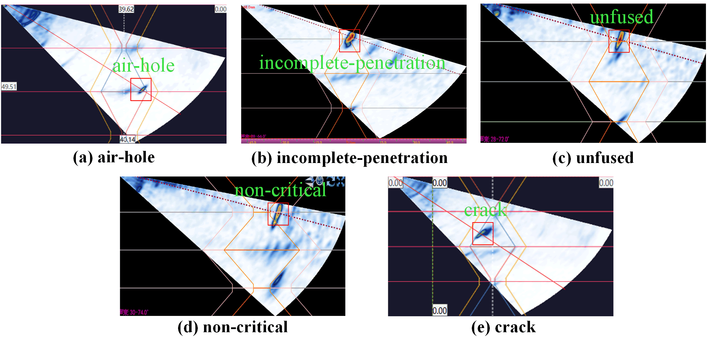

The **TYUST-PAUT** dataset will be released to the public **after the corresponding paper is accepted**.
 Before that, if you would like to use the dataset, please **submit an application and specify your research purpose**.
 For application and usage inquiries, please contact: **[maritdilbert@gmail.com](mailto:maritdilbert@gmail.com)**.
 Access will be provided upon approval. Thank you for your understanding and support.

----------

This dataset, named **TYUST-PAUT**, was jointly collected by the Intelligent Welding Team of Taiyuan University of Science and Technology together with Shanxi Yangmei Chemical Machinery (Group) Co., Ltd., Taiyuan Boiler Group Co., Ltd., and other enterprises, in real industrial production environments. The dataset covers ultrasonic phased array (PAUT) inspection images obtained under various welding processes and material conditions, providing a comprehensive reflection of weld defects encountered in practical industrial scenarios.

As shown in the figure below, small-diameter metal pipes of different materials were fabricated in the partner factories. The inspected workpiece specifications mainly include, but are not limited to:

- Φ51 mm × 5 mm
- Φ51 mm × 6 mm
- Φ60 mm × 5 mm
- Φ60 mm × 7 mm
- Φ42 mm × 6 mm

Here, the number before “Φ” indicates the outer diameter of the pipe (unit: mm). For example, “Φ51 mm” means the pipe has an outer diameter of 51 mm. The number after “×” represents the wall thickness (unit: mm); for instance, “×5 mm” indicates a wall thickness of 5 mm.

Under these conditions, we used phased array inspection equipment to collect ultrasonic signals from the welded regions and identified five typical types of welding defects:

1. Air-hole
2. Incomplete Penetration
3. Unfused
4. Non-Critical Defect
5. Crack

Subsequently, a professional non-destructive testing (NDT) expert team specializing in radiographic inspection was organized. Using the Labelme tool, they conducted precise annotations of the defects in the collected images, including both their locations and categories. After strict image screening, preprocessing, and annotation, the **TYUST-PAUT dataset** was finalized.

